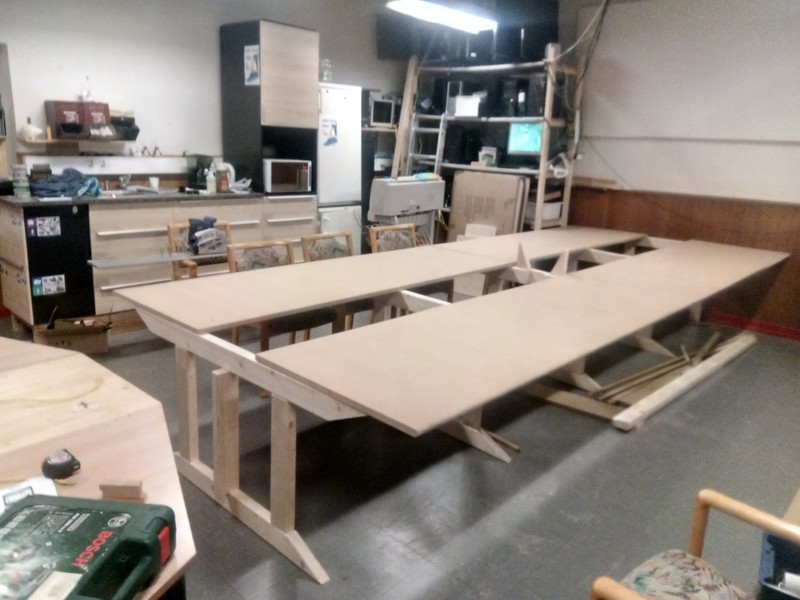
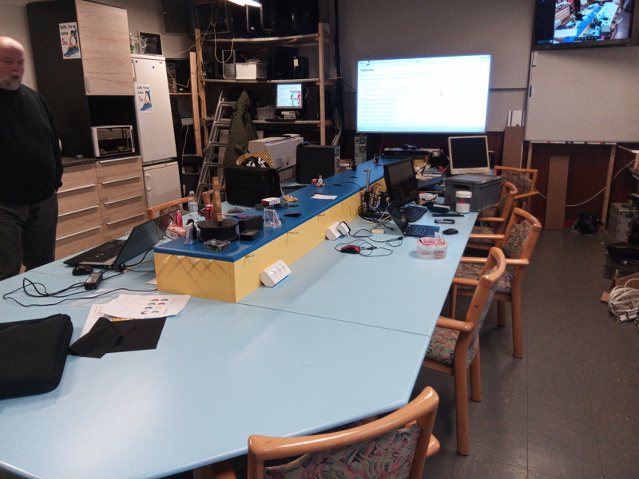

# Nyt bord
Vi har i lang tid syslet med ideer til at få et bedre layout i lokalet. 

Det har resulteret i en beslutning om at få skiftet vore to "runde" borde ud med et langt bord
på langs af lokalet, hvor al vores infrastruktur på bordet samtidig samles, så det ikke er i vejen.

Pladsmæssigt vil det ikke ændre på antallet af sidde-pladser, men vi vil slippe af med følelsen
af være to grupper, når vi er mange samlet. Nu er alle samlet ved samme bord.

## Det nye bord

De grønne halv-cirkler indikerer stole-pladser.

## Processen

### Oktober/november: De store materialer indkøbt. 
Henning har været i Silvan,og købt 22mm MDF.plader,som er skåret til i deres savværk.\
Vi fik en god pris, hvor vi fik opskæringen gratis. Tak for det.\
Pladerne er transporteret til Ullerup.

Der er indkøbt reglar til at lave bordben af.

### 1/11: Affasning af af front kanter
Per og Hening brugte eftemiddagen på at slæbe plader op i sløjd, og retur, for at få afrundet forkanterne på de kommende bordplader.

### 27/12 og 29/12: Oprydning ud nedpilning af gammelt bord, samling af dele til nyt bord.
Bordet under stor-skærmen er blevet rydet og pillet ned.

De tidligere indkøbte reglar er blevet savet til,og samlet til ben-rammer. Simplethen to dyveller og en mother-fucker af en skrue i hver samling, sørger for stabiliteten sideværts på det færdige bord.

Ende-benet op mod vægen er blevet skruet fast i vægen, så det bliver stående, og giver stabilitet i længderetningen.

I den forhøjede del, midt på bordet, skal der installeres strøm og netværk. Stadigvæk med et par store møtrikker på netværkskablerne som kontravægt, så der styr på dem når de hænger ned midt under bordet, uden at de laver knuder.

### 19/1 Samling af den midterset del
Så fik vi også samlet den midterste del af bordet.

De to trekanter midt i kabelkanalen, er et forsøg på understøtning af kabelkanelen, så den bliver mere stabil.

### Grunding og maling af pladerne

Per har brugt en masse tid på at grunde og male alle pladerne. Nogle plader tog sågar på ferie i Broager for at blive malet.

### Installation af strøm og netværk

Der er installeret 3stk strømstik og 2stk netværks-forbindelser på hver plads. Hver plads er defineret som 1/3 af de 240cm lange bordplader på siderne.

For enden af bordet er der 4stk netværks-forbindelser og der kommer 2 gange 3stk strømstik.

Alle netværksforbindelser ud på bordet er et patchkabel som kan skiftes. Patchkablerne som sidder i et stik i kabelkanalen som forbinder til switchen i vores netværks-rack.

Da der ikke er bordben på bordet, er der ikke noget problem, når der bliver trængsel igen til installfesterne.\
Der er plads nok til at der kan sidde 4 personer ved hver bordplade, og 3 pladser for enden, så vi har god plads.\
Hvis vi bliver rigtigt presset, er der plads til 9 stole på langsiderne, men så er det også skulder ved skulder.

## Slut resultatet

Resultatet er blevet rigtigt godt. God plads til alle. Masser af strøm-stik, og masser af netværks-stik.

Næsten for meget plads.\
Særligt efter corona-påvirkningerne, som har gjort at der desværre ikke kommer helt så mange besøgende i foreningen.

Men der kommer forhåbentlig mere gange i sagerne, efterhånden som vi igen får lavet noget larm om Linux på desktoppen.

Nu mangler der kun lige de sidste strøm-stik for enden af kanalen.
