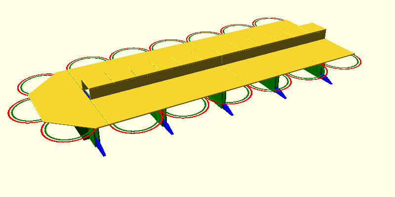
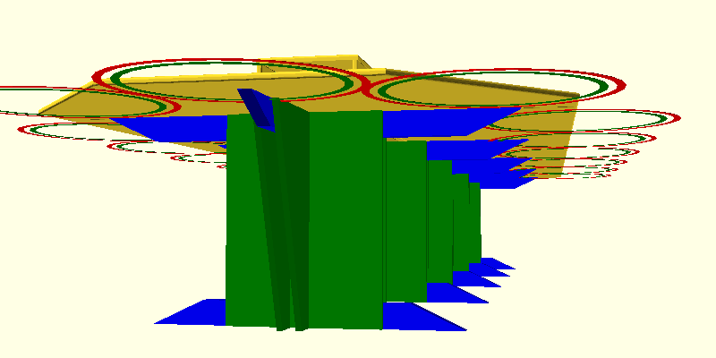
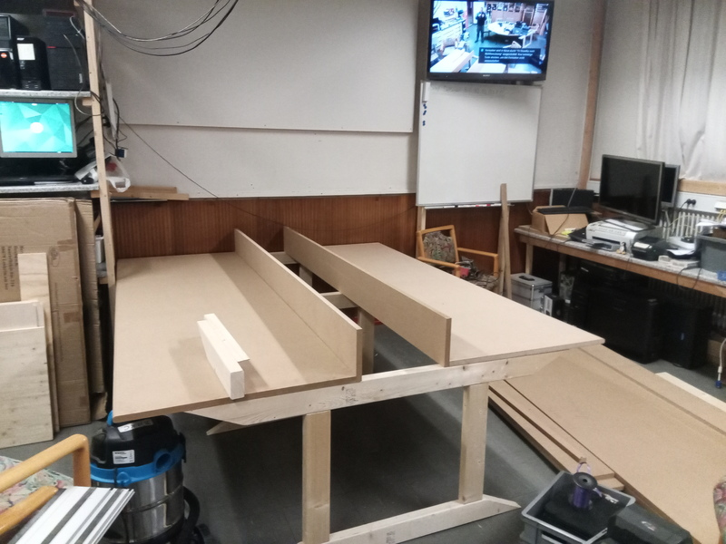

# Nyt bord
Vi har i lang tid syslet med ideer til at få et bedre layout i lokalet. 

Det har resulteret i en beslutning om at få skiftet vore to "runde" borde ud med et langt bord
på langs af lokalet, hvor al vores infrastruktur på bordet samtidig samles, så det ikke er i vejen.

Pladsmæssigt vil det ikke ændre på antallet af sidde-pladser, men vi vil slippe af med følelsen
af være to grupper, når vi er mange samlet. Nu er alle samlet ved samme bord.

## Det nye bord

De grønne halv-cirkler indikerer stole-pladser.

## Processen

### Oktober/november: De store materialer indkøbt. 
Henning har været i Silvan,og købt 22mm MDF.plader,som er skåret til i deres savværk.\
Vi fik en god pris, hvor vi fik opskæringen gratis. Tak for det.\
Pladerne er transporteret til Ullerup.

Der er indkøbt reglar til at lave bordben af.

### 1/11: Affasning af af front kanter
Per og Hening brugte eftemiddagen på at slæbe plader op i sløjd, og retur, for at få afrundet forkanterne på de kommende bordplader.

### 27/12 og 29/12: Oprydning ud nedpilning af gammelt bord, samling af dele til nyt bord.
Bordet under stor-skærmen er blevet rydet og pillet ned.

De tidligere indkøbte reglar er blevet savet til,og samlet til ben-rammer. Simplethen to dyveller og en mother-fucker af en skrue i hver samling, sørger for stabiliteten sideværts på det færdige bord.

Ende-benet op mod vægen er blevet skruet fast i vægen, så det bliver stående, og giver stabilitet i længderetningen.

I den forhøjede del, midt på bordet, skal der installeres strøm og netværk. Stadigvæk med et par store møtrikker på netværkskablerne som kontravægt, så der styr på dem når de hænger ned midt under bordet, uden at de laver knuder.

### Grunding og maling af pladerne

### Installation af strøm og netværk

